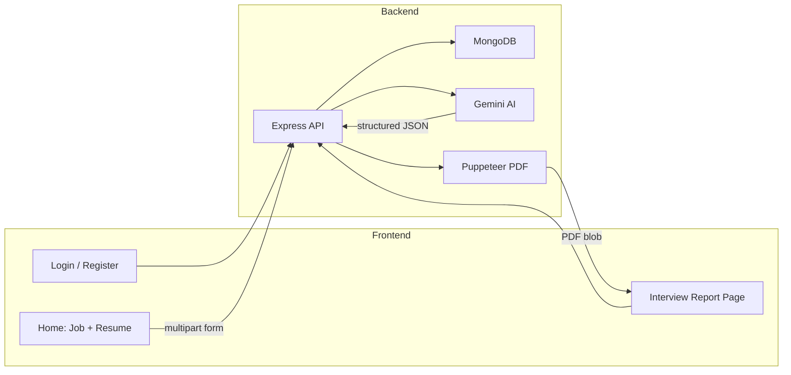

# Interview AI

An AI-powered interview preparation app. Upload your resume (or describe yourself), paste a job description, and get a personalized interview strategy: match score, technical and behavioral questions with model answers, skill gaps, a day-by-day preparation plan, and a tailored ATS-friendly resume PDF.

Built as a full-stack MERN-style project with **React (Vite)** on the frontend and **Node.js + Express + MongoDB** on the backend, using **Google Gemini** for structured AI output.

---

## Features

- **User authentication** — Register, login, and logout with JWT stored in HTTP-only cookies
- **Interview report generation** — AI analyzes resume PDF text, self-description, and job description
- **Match score** — 0–100 fit score for the target role
- **Technical & behavioral Q&A** — Questions with interviewer intent and suggested answers
- **Skill gap analysis** — Missing skills tagged by severity (`low`, `medium`, `high`)
- **Preparation roadmap** — Multi-day plan with focus areas and daily tasks
- **Report history** — View and reopen past interview plans
- **Resume PDF export** — AI-generated HTML resume converted to PDF via Puppeteer

---

## Tech Stack

| Layer      | Technologies |
|-----------|--------------|
| Frontend  | React 19, React Router 7, Vite 7, Axios, Sass |
| Backend   | Node.js, Express 5, Mongoose, Multer, JWT, bcrypt |
| Database  | MongoDB |
| AI        | Google GenAI SDK (`@google/genai`), Gemini (`gemini-3-flash-preview`), Zod schemas for structured JSON |
| PDF       | Puppeteer (resume download) |
| Resume parse | `pdf-parse` |

---

## How It Works



1. User signs up or logs in. The server issues a JWT and sets it in a cookie.
2. On the home page, the user provides a **job description** and either a **resume PDF** or a **self-description** (or both).
3. The backend extracts text from the PDF, sends everything to Gemini with a Zod-defined schema, and saves the structured report in MongoDB.
4. The interview page shows technical questions, behavioral questions, skill gaps, match score, and the preparation roadmap.
5. **Download Resume** triggers another Gemini call to produce tailored HTML, then Puppeteer renders it as a downloadable PDF.

---

## Project Structure

```
interview-ai-yt/
├── backend/
│   ├── server.js                 # Entry point (port 3000)
│   └── src/
│       ├── app.js                # Express app, CORS, routes
│       ├── config/database.js    # MongoDB connection
│       ├── controllers/          # Auth & interview logic
│       ├── middlewares/          # JWT auth, file upload (Multer)
│       ├── models/               # User, InterviewReport, token blacklist
│       ├── routes/               # /api/auth, /api/interview
│       └── services/ai.service.js # Gemini + Puppeteer
├── frontend/
│   └── src/
│       ├── features/auth/        # Login, register, protected routes
│       └── features/interview/   # Home, interview report UI
└── Readme.md
```

---

## Prerequisites

Before you run the project locally, install:

- [Node.js](https://nodejs.org/) (v18+ recommended)
- [MongoDB](https://www.mongodb.com/) — local instance or [MongoDB Atlas](https://www.mongodb.com/cloud/atlas) cluster
- A [Google AI Studio](https://aistudio.google.com/) API key for Gemini

Puppeteer downloads Chromium on `npm install` in the backend. Resume PDF generation needs that browser binary available on your machine.

---

## Environment Variables

Create a `backend/.env` file (this path is gitignored). Do not commit real secrets.

```env
MONGO_URI=mongodb://127.0.0.1:27017/interview-ai
JWT_SECRET=your_long_random_secret_here
GOOGLE_GENAI_API_KEY=your_google_genai_api_key
```

| Variable | Description |
|----------|-------------|
| `MONGO_URI` | MongoDB connection string |
| `JWT_SECRET` | Secret used to sign and verify JWT tokens |
| `GOOGLE_GENAI_API_KEY` | API key for Google Gemini (GenAI SDK) |

---

## Installation & Running

Open two terminals — one for the backend, one for the frontend.

### 1. Backend

```bash
cd backend
npm install
npm run dev
```

The API runs at **http://localhost:3000**.

### 2. Frontend

```bash
cd frontend
npm install
npm run dev
```

The UI runs at **http://localhost:5173** (Vite default).

CORS is configured so only `http://localhost:5173` can call the API with credentials (cookies).

---

## How to Use the App

1. **Register** at `/register` or **login** at `/login`.
2. On the **home page** (`/`):
   - Paste the full **job description** (required).
   - Upload a **resume PDF** (recommended) and/or fill in **self-description**.
   - Click **Generate My Interview Strategy** (may take ~30 seconds).
3. You are redirected to `/interview/:id` where you can:
   - Browse **Technical Questions** and **Behavioral Questions** (expand each card for intention and model answer).
   - Open the **Road Map** tab for the day-by-day preparation plan.
   - See **Match Score** and **Skill Gaps** in the sidebar.
4. Click **Download Resume** to generate and save a job-tailored PDF.
5. Past reports appear under **My Recent Interview Plans** on the home page.

**Tips**

- Either a resume or a self-description should be provided for meaningful results; both together work best.
- Resume uploads are limited to **3 MB** on the server (Multer). Use PDF format.

---

## API Reference

Base URL: `http://localhost:3000`

All interview routes require a valid `token` cookie (set on login/register).

### Auth — `/api/auth`

| Method | Endpoint | Access | Body / Notes |
|--------|----------|--------|--------------|
| POST | `/register` | Public | `{ username, email, password }` |
| POST | `/login` | Public | `{ email, password }` |
| GET | `/logout` | Public | Blacklists token, clears cookie |
| GET | `/get-me` | Private | Returns current user |

### Interview — `/api/interview`

| Method | Endpoint | Access | Body / Notes |
|--------|----------|--------|--------------|
| POST | `/` | Private | `multipart/form-data`: `resume` (file), `jobDescription`, `selfDescription` |
| GET | `/` | Private | List current user's reports (summary fields only) |
| GET | `/report/:interviewId` | Private | Full report by ID |
| POST | `/resume/pdf/:interviewReportId` | Private | Returns PDF file |

---

## AI Output Schema

Gemini returns JSON validated by Zod. Each interview report includes:

- `title` — Job title inferred from the description
- `matchScore` — Number 0–100
- `technicalQuestions` — `{ question, intention, answer }[]`
- `behavioralQuestions` — `{ question, intention, answer }[]`
- `skillGaps` — `{ skill, severity }[]` where severity is `low` | `medium` | `high`
- `preparationPlan` — `{ day, focus, tasks[] }[]`

Resume PDF generation uses a separate prompt that returns HTML, then Puppeteer renders A4 PDF with margins.

---

## Scripts

| Location | Command | Purpose |
|----------|---------|---------|
| `backend/` | `npm run dev` | Start API with nodemon |
| `frontend/` | `npm run dev` | Start Vite dev server |
| `frontend/` | `npm run build` | Production build |
| `frontend/` | `npm run preview` | Preview production build |

---

## Troubleshooting

| Issue | What to check |
|-------|----------------|
| `Connected to Database` never appears | `MONGO_URI` in `backend/.env` and MongoDB running |
| 401 on interview routes | Log in again; cookie may have expired (JWT expires in 1 day) |
| AI errors | Valid `GOOGLE_GENAI_API_KEY` and billing/quota on Google AI |
| Resume PDF fails | Puppeteer/Chromium install; try reinstalling backend deps |
| CORS errors | Frontend must run on port **5173**; backend CORS origin is fixed to that URL |

To point the frontend at a different API host, update `baseURL` in:

- `frontend/src/features/auth/services/auth.api.js`
- `frontend/src/features/interview/services/interview.api.js`

---

## License

This project is licensed under the MIT License — see [LICENCE](LICENCE).
